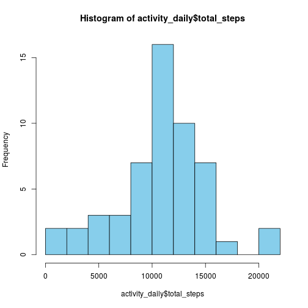
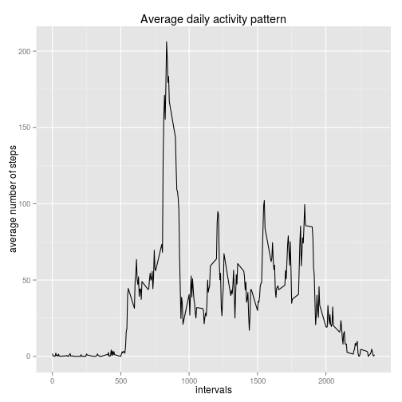
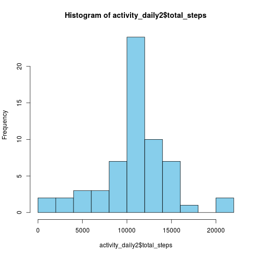
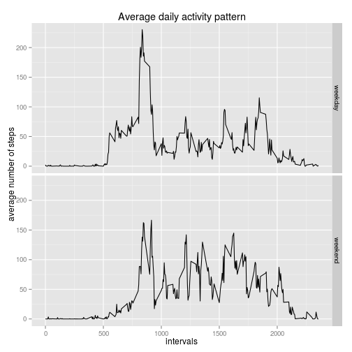

Reproducible Research Peer Assessment 1
===========================

This is a report on a dataset that contains activity information of an individal who was wearing an activity monitoring device during two months. During this period, the number of steps taken by the person was registed for each five minute intervals. 

The analysis of the data follows the guidelines and requirements stated in the first peer review assignment of the Reproducible Research Course of Johns Hopkins Bloomberg School of Public Health offered online on Coursera. 

Loading and preprocessing the data
------------------

The dataset was first loaded into RStudio as follows:


```r
fileURL <- "http://d396qusza40orc.cloudfront.net/repdata%2Fdata%2Factivity.zip"
download.file(fileURL, destfile="/home/jady/Rspace/coursera/Reproducible research/activity.zip")
activity <- read.csv(unzip("/home/jady/Rspace/coursera/Reproducible research/activity.zip"),  header=TRUE)
```

The dataset contained three colomns:
* steps (number of steps taken)
* date (date of the registration of data)
* interval (the number of minutes elapsed that day when the 5-minute interval started)

As prepocessing steps, I converted the date column's factor variables into variables of the date class and I added a new column with factor variables that showed if the measurements were taken on weekdays or on weekends.


```r
library(lubridate)
activity$date <- ymd(activity$date)
days <- weekdays(activity$date)
days <- gsub("lundi", "weekday",days)
days <- gsub("mardi", "weekday",days)
days <- gsub("mercredi", "weekday",days)
days <- gsub("jeudi", "weekday",days)
days <- gsub("vendredi", "weekday",days)
days <- gsub("samedi", "weekend",days)
days <- gsub("dimanche", "weekend",days)
activity <- cbind(activity, days)
```
What is mean total number of steps taken per day?
-------------------

First, the dataset was explored by drawing of a **histogram of the total number of steps taken daily**:


```r
library(dplyr)
```

```r
activity_daily <- tbl_df(activity)
activity_daily <- group_by(activity_daily, date) 
activity_daily <- summarise(activity_daily, total_steps=sum(steps))

hist(activity_daily$total_steps, col="skyblue", breaks=10)
```

 

```r
daily_mean <- format(round(mean(activity_daily$total_steps, na.rm=TRUE), 7))
daily_median <- median (activity_daily$total_steps, na.rm=TRUE)
```

The **median** of the total number of steps taken daily is 10765. 

The **mean** of the total number of steps taken daily is 10766.19.

What is the average daily activity pattern?
---------------

To explore the average daily activity pattern, a time series plot of the 5-minute intervals (x-axis) and the average number of steps taken, averaged across all days (y-axis) was made.


```r
daily_pattern <- tbl_df(activity)
daily_pattern <- group_by(daily_pattern, interval)
daily_pattern <- summarise(daily_pattern, average_steps=mean(steps, na.rm=TRUE))

library(ggplot2)
g <- ggplot(daily_pattern, aes(interval, average_steps))
g + geom_line() + labs(title="Average daily activity pattern") + labs(x="intervals") + labs(y= "average number of steps")
```

 

```r
max_value <- max(daily_pattern$average_steps)
max <- daily_pattern[daily_pattern$average_steps==max_value,]
max_interval <- as.numeric(max[,1])
```

The 5-minute **interval, that contains the maximum number of steps** is the interval 835.

Imputing missing values
-----------------


```r
NA_number <- sum(is.na(activity$steps))
```

In the original dataset, there are 2304 **missing values**, i.e. there are 2304 5-minute intervals, for which no measurement of steps were performed. 

To fill in the missing values of the dataset, I decided to replace NAs with the average number of steps taken for the corresponding interval. 


```r
daily_pattern$average_steps <- format (round(daily_pattern$average_steps, 0))
activity_filled <- activity
for (i in 1:nrow(activity_filled)){
        if (is.na(activity_filled[i,1]) == TRUE) {
              a=activity_filled[i,3] 
              for (e in 1:nrow(daily_pattern)){
                    if (daily_pattern[e,1]==a) {
                          activity_filled[i,1] <- daily_pattern[e,2]
                    }
              }  
        }    
}
activity_filled$steps <- as.numeric(activity_filled$steps)
```

A **histogram of the total number of steps taken daily** was drawn using the dataset without NA values:


```r
activity_daily2 <- tbl_df(activity_filled)
activity_daily2 <- group_by(activity_daily2, date) 
activity_daily2 <- summarise(activity_daily2, total_steps=sum(steps))

hist(activity_daily2$total_steps, col="skyblue", breaks=10)
```

 

```r
daily_mean2 <- format(round(mean(activity_daily2$total_steps, na.rm=TRUE), 7))
daily_median2 <- median (activity_daily2$total_steps, na.rm=TRUE)
```

After filling in the missing values, the **median** of the total number of steps taken daily is 1.0762 &times; 10<sup>4</sup>. 

The **mean** of the total number of steps taken daily is 10765.64.

Compared to the original dataset, there is very little change to the daily mean or median. However, the two histograms show that after imputing missing values, the relative frequency of the days when the number of steps is closely around the average is higher.

Are there differences in activity patterns between weekdays and weekends?
------------------

To examine differences between the activities on weekdays and weekends, a panel plot separating the activities was prepared: two time series plots of the 5-minute intervals (x-axis) and the average number of steps taken, averaged across all days (y-axis) were made.


```r
daily_pattern2 <- tbl_df(activity_filled)
daily_pattern2 <- group_by(daily_pattern2, days, interval)
daily_pattern2 <- summarise(daily_pattern2, average_steps=mean(steps, na.rm=TRUE))

g <- ggplot(daily_pattern2, aes(interval, average_steps))
g + geom_line() + facet_grid(days~.) + labs(title="Average daily activity pattern") + labs(x="intervals") + labs(y= "average number of steps")
```

 
